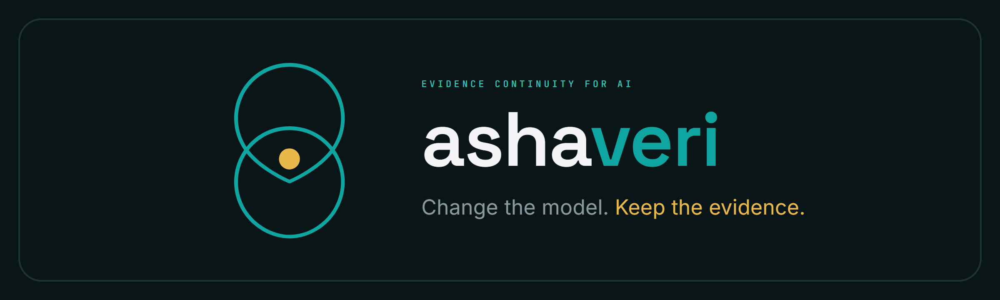

<div align="center">

<a href="https://github.com/ashaveri/ashaveri">
  
</a>

<a href="https://github.com/ashaveri/ashaveri/actions/workflows/ci.yml"></a>
<a href="LICENSE"></a>
<a href="tsconfig.base.json"></a>
<a href="#packages"></a>

<!-- Publish day: replace the static version badge with these and drop the Status note.
<a href="https://www.npmjs.com/package/@ashaveri/sdk"></a>
<a href="https://www.npmjs.com/package/@ashaveri/receipt"></a>
<a href="https://www.npmjs.com/package/@ashaveri/attest-core"></a>
<a href="https://www.npmjs.com/package/@ashaveri/cli"></a>
<a href="https://www.npmjs.com/package/@ashaveri/fixtures"></a>
-->

</div>

# ashaveri

ashaveri is the evidence layer under an AI workflow: OpenAI-compatible inference where every completion
comes back with a signed receipt. A receipt is a COSE_Sign1 document binding the request hash, the
response hash, the model, the weights manifest, and the measurement of the confidential hardware
that answered, and `@ashaveri/sdk` verifies it before your code sees the answer. No verification
service of ours sits in the loop, and the checks are cryptographic rather than something we answer
for you: they run in the copy of this code you build, and the hardware trust roots, AMD's, Intel's and
NVIDIA's published keys, ship inside `@ashaveri/attest-core`. The only thing this project has decided
to run a service for is vendor attestation collateral, the revocation information and TCB info a
verifier would otherwise fetch from the chip vendor itself, offered as a convenience and as a second
source rather than as a precondition; that decision, what it covers and what it leaves to you are in
[Attestation collateral](#attestation-collateral).

## Status

The five publishable packages are at `0.1.0` and are not on npm as of September 2026, so take them
from this repository: `pnpm install && pnpm build`, then import them by path or link the workspace.
Publishing is scheduled against a result rather than a date. `@ashaveri/*` goes to npm with trusted
publishing from CI once a receipt issued by confidential hardware, not by the mock gateway, verifies
end to end through the SDK in strict mode.

## Packages

| Package | Purpose |
|---|---|
| `@ashaveri/receipt` | Deterministic CBOR + COSE_Sign1 receipt codec (RFC 8949 / RFC 9052) |
| `@ashaveri/attest-core` | Offline verification of dStack confidential-VM attestations (SEV-SNP and TDX) |
| `@ashaveri/sdk` | Client SDK: `AshaveriClient` and `wrapOpenAI` with receipt verification |
| `@ashaveri/signerd` | Receipt-signing gateway: mock mode for development, live dStack CVM mode. Every route it serves demands a credential, checks the scope that route needs and rejects a replay and a spent rate bucket before it answers, and writes one access-log line per request; a live start requires `--credentials-path` and `--access-log-path` |
| `@ashaveri/cli` | `ashaveri` binary: `verify` for offline attestation checks, plus `keygen`, `credential` and `accesslog` operator commands, with CI-friendly exit codes |
| `@ashaveri/fixtures` | Golden conformance vectors shared by every implementation |

## Development

```bash
pnpm install
pnpm build
pnpm test
pnpm typecheck
pnpm lint
```

`pnpm lint` checks types through the declarations `pnpm build` emits, so the build has to
run first; CI uses that order.

The receipt wire format is normatively defined in `packages/receipt/receipt.cddl`,
with the full protocol in [docs/receipt-spec.md](docs/receipt-spec.md) and the
threat model in [docs/threat-model.md](docs/threat-model.md). Every error code those
packages throw, with what raises it and what a caller should do, is tabulated in
[docs/error-codes.md](docs/error-codes.md). Who may call at all is
[docs/access-control.md](docs/access-control.md): the admission checks every route runs,
the scope each one needs, and what the per-request access log holds, how long it keeps it,
and how a line is erased. The published conformance vectors are in
[docs/vectors.md](docs/vectors.md). That document says what a
reimplementation in any language is measured against, and how to read each suite.
Fixtures and vectors are regenerated deterministically
with `pnpm --filter @ashaveri/fixtures generate`, and the `generate:` variants named in
that document. What the evidence behind a receipt looked like as it arrived, and the record that would
hold those original bytes beside the context that made them verifiable, is
[docs/capture-v1.md](docs/capture-v1.md): the layout member by member, what each one lets a reader
conclude, and what none of them can.

Reporting a vulnerability and submitting a change have their own pages:
[SECURITY.md](SECURITY.md) and [CONTRIBUTING.md](CONTRIBUTING.md).

## Verifying inference receipts

Start the mock gateway, then call it through the SDK:

```bash
node gateway/dist/cli.js --mock --port 7173
```

Every route a signerd gateway serves refuses a request that names no credential, so the
client signs each request with one. `--mock` prints a development credential at start-up: the id
`dev`, and a key generated when that process starts and gone when it stops. That record is a fixture
of a process that refuses nothing real. `dev` names nothing outside the run that printed it, and a
live gateway answers from the credential file its operator installed, where an id the file does not
carry is refused exactly as a bad signature is. `credentialFromEnv` reads the id and key from the
environment:

```ts
import { AshaveriClient, credentialFromEnv } from '@ashaveri/sdk';

// ASHAVERI_CREDENTIAL_ID=dev ASHAVERI_CREDENTIAL_SECRET=<the privateKeyHex the gateway printed>
const client = new AshaveriClient({ baseUrl: 'http://127.0.0.1:7173/v1', credential: credentialFromEnv(process.env) });
const { completion, receipt } = await client.chat.completions.create({
  messages: [{ role: 'user', content: 'hello' }],
});
// receipt is a verified COSE_Sign1: its hashes bind the exact request and
// response bytes, the model, the token metering, and the claimed measurement.

for await (const chunk of await client.chat.completions.stream({
  messages: [{ role: 'user', content: 'hello' }],
})) {
  process.stdout.write(String(chunk.choices[0]?.delta.content ?? ''));
}
```

For existing code built on the official `openai` client, `wrapOpenAI(client)` wraps the
client's fetch so the same verification runs transparently, with receipts available through
`client.ashaveri.getReceipt(id)`. Verification modes are `off`, `receipt` (default), and
`strict`. Strict mode requires a policy pinning keys, issuers, instances and measurements, and
adds the hardware step: it fetches the evidence whose digest the receipt signed, verifies the
platform signature offline, and refuses a document whose report data or measurement disagrees
with this request and the receipt. `@ashaveri/attest-core` bundles Intel's SGX root CA, the
AMD Milan ARK and NVIDIA's device identity root as the roots to chain to;
`policy.trustAnchors` replaces them. A receipt whose `tee` claims a confidential-computing GPU
costs a second fetch, the device bundle from the route beside the platform one, and is refused
unless a device report that signed this request's digest verifies inside it.

`--live` runs the same gateway inside a dStack confidential VM. There the signing key comes
from the guest agent and the measurement, issuer and instance come out of the hardware
evidence rather than from strings; [enclave/README.md](enclave/README.md) is the deployment
procedure.

The mock gateway signs with a development key in process memory, and its measurement, evidence
URL and weights digests are fixed development values. It reports `tee: "software"`, the one kind
in the protocol that claims no hardware protection, so read a mock receipt as proof that the mock
gateway signed those bytes and nothing more. See
[docs/threat-model.md](docs/threat-model.md) for what receipts do and do not prove in mock mode
and in live mode.

## Verifying an attestation

```bash
node packages/cli/dist/cli.js verify attestation.bin \
  --ark amd-ark.pem --ask ask.pem --vcek vcek.pem \
  --expect-measurement <96-hex> --expect-compose-hash <64-hex>
```

SEV-SNP attestations are verified offline against a pinned AMD ARK: the ARK to ASK to VCEK
certificate chain, the VCEK-to-report binding (chip id, product line, TCB), the report's
ECDSA P-384 signature, the guest policy, the runtime event log, and the mr_config to
HOST_DATA binding. Exit code 0 means verified and every `--expect-*` pin matched; 1 means
verification or a pin failed; 2 means usage or input error. Pass `--json` for
machine-readable output and `--report-data <hex>` to bind a nonce. TDX attestations always
verify the event log and RTMR3 replay. With `--intel-root <pem>` they also verify the Intel
DCAP quote signature: the quote's ECDSA P-256 signature under its attestation key, that key
bound by the QE report, and the report bound by a PCK chain that must reach the pinned Intel
root CA. Without it, `quoteSignatureVerified` is `false` on TDX and the CLI says so. Either
way the MVP does not fetch Intel collateral, so a verified TDX signature does not yet tell you
that the platform's TCB is unexpired, that its QE identity is valid, or that its PCK has not
been revoked.

A confidential-computing GPU attests on its own: the dStack envelope carries no device
report, so `--gpu-report <bin> --gpu-chain <pem>` supplies a captured NVIDIA SPDM
measurements report and the chain it was signed under, paired by position, and
`--gpu-root <pem>` names the device identity root that chain must reach. Each report's
ECDSA P-384 signature is verified offline under that root, and the challenge the device
signed is printed beside the report data above. With `--report-data` pinned, a device that
answered a different challenge fails with `CHALLENGE_MISMATCH`, because it is evidence about
some other request. What the check does not establish is that the device which signed the
report is the one attached to the attesting VM. That needs TDISP, and no route purchasable
today provides it, so a composite claim proves a genuine CPU TEE and a genuine device
signature and stops there.

Verification proves an attestation is genuine; pinning turns it into a decision about *this*
deployment. `--expect-measurement` compares the platform launch digest, the SEV-SNP launch
digest or the TDX MRTD, against the value you measured when you built the image.
`--expect-compose-hash` compares the dstack compose hash the platform committed to: on
SEV-SNP it is read from the mr_config document already hashed into HOST_DATA, and on TDX,
where the envelope carries no document, from the `compose-hash` runtime event that the RTMR3
replay ties to the quote. A mismatch exits 1 with code `PIN_MISMATCH` and names both the
observed and the pinned value, so a rebuilt image, an edited compose file, or evidence from
another VM is rejected rather than merely reported. Take pinned values from a source you
trust independently of the deployment under test: a measurement the deployment publishes
about itself is a claim to check against your pin, not a pin.

## Attestation collateral

**What the verifier does today.** It checks signatures and certificate chains offline, against the
roots bundled in `@ashaveri/attest-core` or the roots you pass it, and it consults no vendor endpoint
for attestation collateral, and that includes our own. The consequence is written down rather than
smoothed over: with a pinned Intel root, a TDX quote is verified under its attestation key, that key
inside the QE report, and the report under a PCK chain reaching the root, while Intel's TCB Info, the
QE Identity and the TCB CRL go unread; on AMD, the ASK and VCEK are the files you supply and KDS is not
queried; a confidential-computing GPU's chain is verified under the device root you pin, and NVIDIA's
revocation information and reference driver and VBIOS measurements go unread as well. So a platform
that its vendor has since deprecated or revoked still verifies here, which is what
[docs/threat-model.md](docs/threat-model.md) row T12 and section 6 say in the same terms. That is a
property of an offline check and it is deliberate. The evidence document reaches a client from the
deployment's own evidence URL, in `strict` mode, and that fetch is to the deployment rather than to
us.

**What was decided on 21 September 2026.** This project decided to run a service publishing exactly
the collateral named above: the TCB info, the QE identity and the revocation status, and the reference
measurements a device verdict needs, all fetched from Intel's, AMD's and NVIDIA's own endpoints and
republished, offered as a convenience and as a second source. Nothing of it exists yet: no endpoint
runs, no package in this repository reads one, and the paragraph above is the whole of present
behaviour. Three things were settled with it. A deployer who declines the service gives up nothing,
because a feed is a second source and not a precondition, and no verdict a third party can reach
depends on our service existing; the fetching code and the defaults it fetches under are published
here in source, because fetching collateral that can change a verdict is itself something a verdict
reads; and an unreachable or unanswered feed has to be reported as freshness unknown and refused rather
than pass a check it did not perform. That refusal is not in this code today either, and the refusals
that do exist, tabulated in [docs/error-codes.md](docs/error-codes.md), include none that consults a
vendor's revocation information or TCB info.

**What stays the deployer's if the service is declined.** The freshness judgement, entirely, exactly
as it is today. Either source the collateral directly, from Intel's provisioning certification
endpoints, AMD's KDS and NVIDIA's revocation and reference measurements, and hand it to the verifier
through its own options, or accept the documented residual risk in
[docs/threat-model.md](docs/threat-model.md) and say so plainly in your own deployment's
documentation. A pinned root answers who signed something. It answers nothing about whether the
platform behind that signature is still trusted by its vendor, and this repository's documents are
written so that a deployer finds that out by reading them rather than by being attacked.

## License

Code is licensed under [Apache-2.0](LICENSE). The golden conformance vectors in `@ashaveri/fixtures` are dedicated to the public domain under [CC0-1.0](packages/fixtures/LICENSE), so downstream reimplementations can embed them without attribution obligations.

What this repository keeps public, and the one rule that decides it, is
[CONTRIBUTING.md § What stays open, and what does not](CONTRIBUTING.md#what-stays-open-and-what-does-not).
The same page states this project's patent and design position under the heading
[Patents and designs](CONTRIBUTING.md#patents-and-designs); in short, it claims none.
